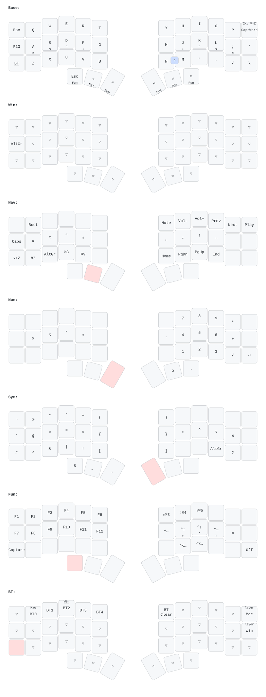

# Corne wireless ZMK config

키맵 하나로 여러 대의 Corne 펌웨어를 빌드한다.

## 구성

| 파일 | 역할 |
|---|---|
| `config/corne.keymap` | 모든 키보드가 공유하는 키맵 |
| `config/corne.conf` | 공통 설정 (sleep, 디스플레이, Studio 등) |
| `build.yaml` | 키보드별 빌드: 디스플레이 shield, 블루투스 이름, 결과 파일 이름 |
| `keymap_drawer.config.yaml` | 위 키맵 그림 설정 ([keymap-drawer](https://github.com/caksoylar/keymap-drawer)) |

| 키보드 | 디스플레이 | BT 이름 / 펌웨어 |
|---|---|---|
| mint | nice!view | `mint_corne` |
| brown | OLED | `brown_corne` |

## 펌웨어 받기

`master`에 push하면 GitHub Actions(**Build ZMK firmware**)가 모든 키보드를 빌드한다.
run 페이지의 **Artifacts → firmware** 안에 `mint_corne_left.uf2` 처럼 키보드별 파일이 있다.
키맵이 바뀌면 **Draw keymap** workflow가 위 그림을 다시 그려 커밋한다.

## 키보드 추가

`build.yaml`에서 left/right 두 항목을 복사해 `cmake-args`의 이름(최대 16자)과 `artifact-name`만 바꾼다.

## 참고

- ZMK Studio로 바꾼 키는 키보드에 저장되어 파일 키맵보다 우선한다. 파일에도 반영하거나 Studio에서 *Restore Stock Settings*.
- 예전 키보드별 브랜치는 `archive/*` 태그로 보관돼 있다.
